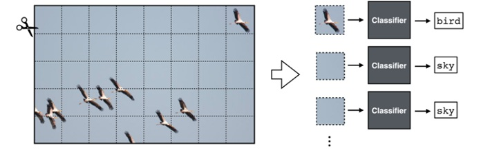

# Convolutional Neural Nets

Building on the concepts introduced in the foundations section, I will now describe neural networks for vision. One way of understanding neural networks is to think of them as big signal processors, built as a succession of multiple stages (layers) of learned linear filters (convolutional units) followed by nonlinearities.

## Introduction

- **Chapter @sec-convolutional_neural_nets** introduces convolutional neural networks, which are very much like image pyramids, but with learned filters.

The key idea of CNNs is to chop up the input image into little patches,
and then process each patch *independently* and *identically*. The gist
of this is captured in {width="95%"}

Each patch is processed with a classifier module, which is a neural net.
Essentially, this neural net scans across the patches in the input and
classifies each. The output is a label *for each patch in the input
image*.

