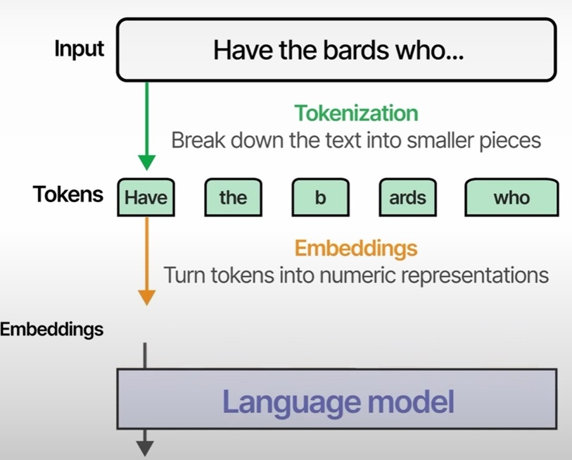

# Neural Networks 

## Introduction

Neural networks are functions loosely modeled on the brain. In the
brain, we have billions of neurons that connect to one another. Each
neuron can be thought of as a node in a graph, and the edges are the
connections from one neuron to the next. The
edges are directed; electrical signals propagate in just one direction
along the wires in the brain.

## Tokenization & Embedding

The process of breaking down text into smaller pieces is called tokenizatino and each piece is a token. Each token is then transformed into a numerical representation, called embedding. These are also called vector values and they represent the semantic nature of a given text. Tokenizers have a limited
number of tokens or vocabulary, so whenever they encounter an unknown word, they can still be represented by these sub tokens.

Outgoing edges are called axons and incoming edges are called dendrites.
A neuron fires, sending a pulse down its axon, when the incoming pulses,
from the dendrites, exceed a threshold.

## The Perceptron: A Simple Model of a Single Neuron

Let's consider a neuron, shaded in gray, that has four inputs and one
output (@fig-neural_nets-perceptron_fig2).
