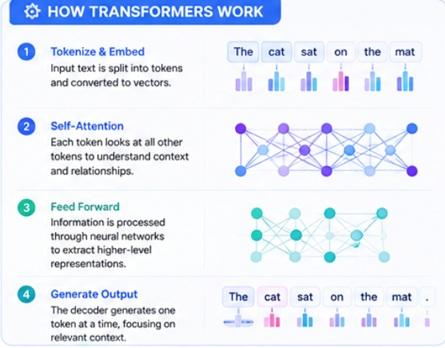

## Introduction

In transformer architecture, recurrence is abandoned completely. Parallel processing takes over processing tokens one by one in sequence. Entire sequence of texts are processed simultaneously using attention mechanisms. This design made them better at capturing long-range relationships in language and highly scalable powering LLMs such as GPT-4, Claude and Gemini.

## How Transformers Work

The key idea:

1. Tokenize and Embed ~ Input text is split into tokens and converted into vectors.

2. Self-Attention ~ Each token looks at all other tokens to understand context and relationships.

3. Feed Forward ~ Information is processed through neural networks to extract higher level repreesntations.

4. Generate Output ~ The decoder generates one token at a time, focusing on relevant context.

The gist of this is captured in {width="95%"}

## Self-Attention : The Backbone of the Transformer Model 

The idea of attention in neural nets can be motivated by attention in human perception. When we look at a scene, our eyes flick around and we attend to certain elements that stand out, rather than taking in the whole scene at once [3]. If we are asked a question about the color of a car in the scene, we will move our eyes to look at the car, rather than just staring passively. Can we give neural nets similar capability?

Here is how it works: 

1. For each token in the input sequence, the model computes three vectors: a query, a key, and a value. These are produced by multiplying the token’s input representation by three separate learned weight matrices.

2. The query from one token is then compared against the keys of all other tokens in the sequence using a dot product, which produces a score indicating how much that token should attend to each other token. 

3. These scores are scaled and passed through a softmax function to produce attention weights that sum to one.

4. Finally, the attention weights are used to compute a weighted sum of all value vectors, producing a new representation for the current token that incorporates information from across the entire sequence.

As such, each token’s final representation is shaped not just by the token itself but by all other tokens it has attended to, weighted by how relevant they were deemed to be. 

Multi head attention extends  running the attention computation multiple times in parallel with different learned weight matrices, called heads, each potentially learning to capture different kinds of relationships in the text. Some heads might learn syntactic dependencies, others semantic associations, others coreference relationships. 

## Positional Encoding : Giving The Model a Sense of Order

A consequence of removing recurrence from the architecture is that the transformer has no inherent sense of word order. Recurrent networks knew that word five came after word four because they processed them in sequence. The transformer processes all tokens in parallel, so it needs an explicit mechanism to represent position. More recent architectures like RoPE, or Rotary Position Embedding learn positional representational during training rather than using fixed mathematical functions. 

## Why Transformers Scale So Well 

The key is that transformers are genuinely parallelizable in ways that recurrent models were not. During training, a transformer can process the entire sequence and compute all attention weights in parallel. Every attention head, every layer, and every token position can be computed simultaneously on different parts of the GPU hardware. This means that adding more compute, whether more GPUs or more powerful chips, directly translates into being able to train larger models on more data in reasonable time.
